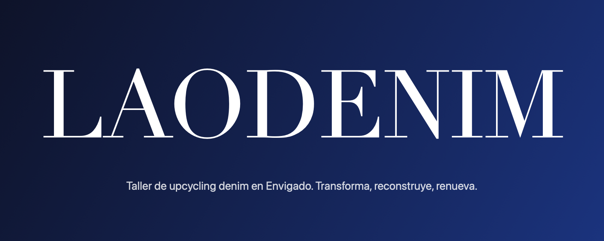

<p align="center">
  
</p>

# LAODENIM

**Transforma, reconstruye, renueva.**

Sitio web de LAODENIM, taller de upcycling denim en Envigado, Antioquia. Ocho sábados para convertir jeans viejos en piezas nuevas: tie-dye, bordado, reconstrucción y una colección cápsula propia. Presencial o virtual.

## Qué incluye la página

- Pantalla de carga con la marca y titular que sube línea por línea
- Hero en marco redondeado con video que avanza al hacer scroll
- Tira horizontal de piezas que se desplaza con el scroll (en móvil se desliza con el dedo)
- Manifiesto que se enciende palabra por palabra
- Modalidad presencial y virtual, las 8 clases por módulo, precios y preguntas frecuentes
- Botones de WhatsApp con mensaje prellenado
- SEO básico y datos estructurados (`Course`), diseño responsive y animaciones que respetan «reducir movimiento»

## Tecnología

Next.js 16 (App Router, exportación estática), React 19, TypeScript, Tailwind CSS 4, Motion, GSAP + ScrollTrigger, Lenis (scroll suave) y Lucide. Tipografías: Instrument Serif e Inter (Google Fonts).

## Cómo correrla

Necesitas Node.js 20 o superior.

```bash
cd site
npm install
npm run dev
```

Abre http://localhost:3000.

Para generar la versión de producción (queda en `site/out`):

```bash
npm run build
```

## Variables de entorno

Copia `site/.env.example` a `site/.env.local` y ajusta:

| Variable | Qué hace |
|----------|----------|
| `NEXT_PUBLIC_WHATSAPP` | Número de WhatsApp con indicativo, sin `+` (ej. `573001234567`) |
| `NEXT_PUBLIC_BASE_PATH` | Solo para GitHub Pages; el workflow lo define solo |

Nunca subas `.env.local` al repositorio: está en `.gitignore`.

## Publicación

Cada push a `main` publica en GitHub Pages con `.github/workflows/deploy.yml`. Para que funcione: en el repo, **Settings → Pages → Source: GitHub Actions**. El número de WhatsApp se toma de la variable de repositorio `WHATSAPP` (**Settings → Secrets and variables → Actions → Variables**).

## Estructura

```
site/
├── public/             Cuadros del hero (hero-frames/) e imágenes
└── src/
    ├── app/            Página, estilos globales y metadatos
    ├── components/     Hero, tira de piezas, manifiesto, nav, preloader
    ├── data/           Textos, precios, clases y preguntas
    └── lib/            Utilidades
docs/
├── brand-context-laodenim.md   Identidad y tono de la marca
├── design-system.md            Decisiones de diseño (versión 1)
└── audit-v1.md                 Auditoría de la versión anterior
.github/workflows/      Publicación automática
```

## Cómo editar el contenido

Textos, precios, clases y preguntas viven en `site/src/data/content.ts`. Las fotos de las piezas están en `site/public/img/`.

## Pendientes

- Definir el número real de WhatsApp (`NEXT_PUBLIC_WHATSAPP`)
- Reemplazar las fotos de camisetas por fotos propias de jeans transformados
- Confirmar precios, fecha de la feria y horarios
- Agregar reseñas reales de alumnas cuando existan

## Marca

- **Color principal:** índigo `#1B3A8C`, con blanco y negro
- **Tono:** directo y cercano; habla de oficio, no de moda pasajera
- **Público:** personas que quieren aprender a transformar ropa y venderla

© 2026 LAODENIM. Hecho en Envigado, Colombia.
